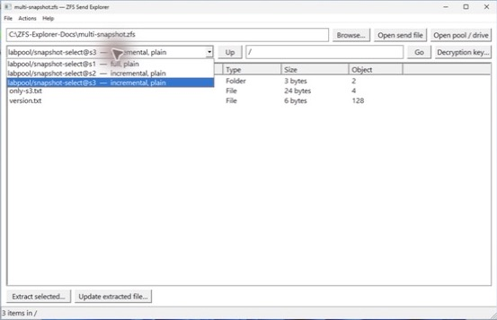

# zfs-send-extract

`zfs-send-extract` is an experimental, pure-userspace toolkit for browsing and extracting individual files from ZFS backups without importing or mounting a pool. It includes the cross-platform CLI and an additional native Windows desktop client. Both work with ZFS send files and, within a deliberately narrow pool layout, exported ZFS vdev members or images.

The extraction machine does **not** need ZFS, `libzfs`, or a ZFS kernel module. The tool never invokes `zfs` or `zpool`, and pool members are opened read-only.

> [!IMPORTANT]
> This is an early `0.1.0` implementation. The CLI, Windows UI, sidecar format, and supported on-disk profile may change. Stream fixtures are produced on little-endian OpenZFS systems. Linux validates the core end to end, and CI builds and tests the native Windows target.

Detailed implementation and validation material lives in:

- [`docs/format-notes.md`](docs/format-notes.md), which maps the supported send and on-disk formats to the reader; and
- [`docs/test-evidence.md`](docs/test-evidence.md), which records the real OpenZFS fixtures, lab scenarios, sizes, and hashes.
- [`docs/windows-client.md`](docs/windows-client.md), which covers the Windows UI, attached-drive access, updates, sparse files, and packaging.

## What works today

| Source or operation | Status |
| --- | --- |
| Inspect a full or incremental send stream | Supported |
| Browse and extract a regular file from a plaintext full send | Supported |
| Select a snapshot from a self-contained compound or concatenated send file | Supported |
| Update an extracted file with a matching plaintext incremental send | Supported |
| Browse and extract from a full raw encrypted send (`zfs send -w`) | Supported |
| Select from a self-contained raw encrypted incremental chain | Supported |
| Apply a matching raw encrypted incremental send | Supported with the extraction key and raw sidecar state |
| Authenticate and decode raw encrypted SA spill blocks | Supported |
| Read compressed blocks in raw sends | LZJB, LZ4, gzip, ZLE, and Zstandard |
| Read compressed replay records from `zfs send -c` | Supported |
| Read embedded-data replay records from `zfs send -e` | Supported |
| Browse a single exported disk/file vdev or one leaf of a single top-level mirror | Supported |
| Browse current datasets and named snapshots directly from a pool member | Supported |
| Native Windows snapshot browser and extractor | Supported as `zfs-send-explore-windows.exe` |
| Open a GPT whole-disk image or `\\.\PhysicalDriveN` | Supported when exactly one partition has a supported ZFS vdev label |
| Preserve sparse holes during extraction and incremental updates | Supported; zero ranges are deallocated when the destination filesystem permits it |
| Read compressed and embedded blocks from a pool member | LZJB, LZ4, gzip, ZLE, and Zstandard |
| Extract from a native-encrypted pool dataset | Not yet supported |
| Read RAIDZ/dRAID or pools with several top-level vdevs | Not yet supported |

The tool extracts regular files only. It can list directories and report symlinks, but it does not recreate directory trees, symlinks, ownership, permissions, ACLs, or other filesystem metadata.

## Downloads

Portable release builds are available from the [GitHub Releases page](https://github.com/amcchord/zfs-send-explore/releases/latest). No installer is required.

| Asset | Contents |
| --- | --- |
| `zfs-send-extract-linux-x86_64.tar.gz` | Linux x86-64 command-line client |
| `zfs-send-extract-windows-x86_64.exe` | Windows x86-64 command-line client |
| `zfs-send-explore-windows-x86_64.exe` | Native Windows x86-64 desktop client |
| `zfs-send-explore-windows-x86_64.zip` | Both Windows executables, the illustrated Windows guide, screenshots, README, and license |
| `SHA256SUMS.txt` | SHA-256 checksums for every downloadable program and archive |

Verify a Windows download before running it:

```powershell
Get-FileHash .\zfs-send-explore-windows-x86_64.exe -Algorithm SHA256
```

On Linux, extract the CLI archive and run it directly:

```sh
tar -xzf zfs-send-extract-linux-x86_64.tar.gz
./zfs-send-extract --help
```

The Windows executables are currently unsigned, so Microsoft Defender SmartScreen may display an unrecognized-app warning. Check the release checksum and repository source before choosing to run the program.

## Build

Rust 1.87 or later is required:

```sh
git clone https://github.com/amcchord/zfs-send-explore.git
cd zfs-send-explore
cargo build --release
```

The executable is written to `target/release/zfs-send-extract`. ZFS is needed only on a system that creates send files or test fixtures; it is not a runtime dependency of the CLI.

```sh
cargo test
cargo clippy --all-targets -- -D warnings
```

### Native Windows client



On Windows 10 or 11, build the GUI with the stable MSVC Rust toolchain and the Windows SDK:

```powershell
cargo build --release --bin zfs-send-explore-windows
.\scripts\package-windows.ps1
```

The GUI binary is `target\release\zfs-send-explore-windows.exe`; the packaging script also builds `zfs-send-extract.exe` and creates a distributable ZIP containing both clients and the illustrated documentation. It uses Win32 common controls, Windows file dialogs, the Segoe UI system typeface, per-monitor DPI scaling, and background workers so long stream scans do not block the window.

Open a send file or vdev image with **Browse**, or type a raw device path such as `\\.\PhysicalDrive3` and choose **Open pool / drive**. Physical-drive access normally requires starting the client as Administrator. The reader opens the source read-only, validates GPT metadata when auto-selecting a partition, and never imports or mounts the pool. See [the Windows client guide](docs/windows-client.md) for the complete workflow and safety constraints.

## Browse and extract from a send file

Inspect the stream and discover the snapshots it contains:

```sh
zfs-send-extract inspect backup.zfs
zfs-send-extract inspect backup.zfs --json
zfs-send-extract snapshots backup.zfs
```

List a directory and extract one file:

```sh
zfs-send-extract list backup.zfs /
zfs-send-extract list backup.zfs /payload
zfs-send-extract extract backup.zfs /payload/large.bin --output large.bin
```

Paths inside ZFS are absolute. Existing output files are preserved unless `--force` is supplied.

### Select a snapshot

When a send file contains more than one snapshot, select one by short name, full `dataset@snapshot` name, or `0x`-prefixed snapshot GUID:

```sh
zfs-send-extract snapshots history.zfs
zfs-send-extract list history.zfs /payload --snapshot s2
zfs-send-extract extract history.zfs /payload/large.bin \
  --snapshot tank/data@s2 \
  --output large-at-s2.bin
```

Selection is required when several snapshots are present, preventing the CLI from silently choosing the wrong dataset in a recursive package. The chosen snapshot must have a complete ancestry chain back to a full substream in the same file.

For example, `zfs send -I tank/data@s1 tank/data@s3` contains `s2` and `s3`, but not its starting snapshot `s1`. Make a self-contained history by concatenating the full base and compound incrementals:

```sh
zfs send tank/data@s1 > base.zfs
zfs send -I tank/data@s1 tank/data@s3 > increments.zfs
cat base.zfs increments.zfs > history.zfs

zfs-send-extract extract history.zfs /payload/large.bin \
  --snapshot s2 \
  --output large-at-s2.bin
```

The catalog and metadata passes retain only the information needed to resolve the requested path. The data pass writes only the selected object's extents; it does not receive the dataset or materialize every file in the stream.

## Apply an incremental send

Every successful send-stream extraction writes a JSON sidecar beside the output. For `large.bin`, the sidecar is `large.bin.zfse.json`. It records the DMU object, snapshot GUID, logical size, relevant metadata offset, and SHA-256 hash.

Use a matching ordinary incremental send to advance the file:

```sh
zfs send tank/data@s1 > full-s1.zfs
zfs send -i tank/data@s1 tank/data@s2 > s1-to-s2.zfs

zfs-send-extract extract full-s1.zfs /payload/large.bin --output large.bin
zfs-send-extract apply s1-to-s2.zfs large.bin
```

Before applying changes, the CLI verifies the sidecar's base GUID, the target's current size, and its SHA-256 hash. It replays matching object and spill metadata, ordinary or compressed writes, embedded writes, and free records into a temporary file. Only after validation succeeds does it atomically replace the target and advance the sidecar to the new snapshot and hash.

The update fails safely if the file has been modified locally, the incremental stream starts from another snapshot, or the file was deleted and recreated under a different DMU object number.

## Raw encrypted sends

Full and incremental raw sends produced by `zfs send -w` can be inspected without ZFS. Stream framing and snapshot names remain visible, so `inspect` and `snapshots` do not require a key. File paths, metadata, and contents require the dataset key:

```sh
zfs-send-extract snapshots encrypted-raw.zfs
zfs-send-extract list encrypted-raw.zfs / --key-file ./dataset.key
zfs-send-extract extract encrypted-raw.zfs /payload/large.bin \
  --key-file ./dataset.key \
  --output large.bin
zfs-send-extract apply encrypted-incremental.zfs large.bin \
  --key-file ./dataset.key
```

When attached to a terminal, `list`, `extract`, and raw `apply` prompt without echo for passphrase and hex keys if `--key-file` is omitted. Non-interactive use requires `--key-file`. Supported OpenZFS key formats are:

- passphrase, with one final newline in the key file ignored;
- hex key, with one final newline ignored; and
- raw key, which must be exactly 32 binary bytes and always uses `--key-file`.

OpenZFS AES-CCM and AES-GCM suites at 128, 192, and 256 bits are supported. Wrapped-key authentication, block tags, authenticated metadata, SA spill blocks, and the indirect checksum-of-MAC tree are verified before decrypted data is used. Key material is zeroized after use and is never stored in the extraction sidecar.

Selecting a raw incremental snapshot from a history file follows the same rule as plaintext selection: the full raw base and every required incremental substream must occur earlier in the same file. The reader retains the raw block-pointer authentication state needed to validate each updated 32-slot dnode range.

A raw extraction sidecar additionally stores the portable dnode and block-MAC state for the target's range. This lets `apply` authenticate a standalone raw incremental without retaining the full base stream. The sidecar may be larger than a plaintext sidecar for files with many blocks, but it contains no encryption key. Raw `apply` validates the key identity, base snapshot GUID, file hash, individual target blocks, and the updated dnode-range authentication tag before replacing the target.

## Browse an offline pool member

The `pool` command family reads an exported vdev using positioned I/O. Pass an exact ZFS partition, file vdev, or image. A GPT whole-disk image is also accepted when exactly one partition contains readable ZFS vdev labels; the Windows client uses the same discovery for `\\.\PhysicalDriveN`.

Export a live pool first. This keeps the selected uberblock stable and prevents blocks from being freed and reused during traversal:

```sh
zpool export tank

zfs-send-extract pool inspect /dev/disk/by-id/example-part1 --json
zfs-send-extract pool datasets /dev/disk/by-id/example-part1
zfs-send-extract pool snapshots /dev/disk/by-id/example-part1 tank/data
zfs-send-extract pool list /dev/disk/by-id/example-part1 \
  tank/data@backup-2026-08-07 /payload
zfs-send-extract pool extract /dev/disk/by-id/example-part1 \
  tank/data@backup-2026-08-07 /payload/large.bin \
  --output large.bin
```

The reader scans all four vdev labels, selects the highest active uberblock, validates supported checksums before decompression, walks the MOS and DSL dataset tree, and resolves paths through ZPL ZAP and System Attribute metadata. It does not load the entire member into memory.

Current pool-layout support is intentionally conservative:

- one top-level disk or file vdev; or
- one top-level mirror, using either healthy leaf independently.

A pool containing multiple top-level vdevs needs members from each top-level vdev and is rejected because the CLI currently accepts only one source. RAIDZ/dRAID, special or dedup allocation classes, device-removal mappings, gang blocks, and native-encrypted datasets are also rejected explicitly.

Extracting from a named pool snapshot writes the same incremental-compatible `.zfse.json` sidecar used by send extraction. Extracting from a current dataset head is supported, but it intentionally removes or omits the sidecar because a live head is not a valid incremental-send base snapshot.

The pool reader targets ZFS filesystem datasets. ZVOLs contain a block device rather than a ZPL path tree and therefore cannot be browsed as individual files by this tool.

## Compression support

Dataset compression does not normally make a plaintext send incompatible: without `zfs send -c`, OpenZFS emits logical, uncompressed replay payloads. Compressed replay records emitted by `zfs send -c` are also decoded directly.

Raw encrypted sends and direct pool-member reads preserve on-disk compression. These paths share a pure-Rust decoder for:

- compression off;
- LZJB;
- LZ4;
- gzip levels 1 through 9;
- ZLE; and
- Zstandard, including OpenZFS's magicless Zstandard frame.

The send reader handles `WRITE_EMBEDDED` records emitted by `zfs send -e`, including their eight-byte wire padding and logical block zero-fill semantics. OpenZFS does not permit `WRITE_EMBEDDED` records in raw streams; raw sends represent protected blocks with ordinary raw `WRITE` records instead. The pool backend independently handles embedded block pointers on disk.

## Integrity and safety model

The CLI treats stream and pool metadata as untrusted input and fails closed when it encounters an unsupported or inconsistent layout:

- send records and terminal stream checksums are validated, and truncated streams are rejected;
- raw encrypted keys, block tags, authenticated metadata, spill blocks, and dnode-range tags are verified before decrypted bytes are used;
- supported pool block checksums are verified before decompression, with alternate DVA copies tried when present;
- pool members are never written, imported, or mounted; and
- extraction and incremental updates are built in a temporary file beside the destination, synchronized, and atomically renamed only after validation completes.

The `.zfse.json` sidecar is part of an extracted file's update state. Keep it beside the file and do not edit it. Raw sidecars contain portable block-authentication metadata but never the encryption key; they may still reveal path, object, size, and snapshot information. Passphrases committed under `tests/fixtures` are intentionally public test credentials and must never be reused for real datasets.

Extraction marks Windows destination files sparse and replays ZFS holes without materializing their zero bytes. Incremental updates copy only allocated source ranges when the host filesystem provides that information, and FREE records deallocate ranges on NTFS/ReFS, Linux filesystems with hole punching, and APFS. On filesystems without sparse controls, the logical content remains correct but zero ranges may consume physical space.

This remains experimental software, not a replacement for maintaining independently verified backups. Preserve the original send file or pool member until the extracted result has been checked for the intended recovery use.

## Command reference

| Command | Purpose |
| --- | --- |
| `inspect <stream> [--json]` | Validate framing and checksums; summarize snapshots and replay records |
| `snapshots <stream>` | List the full/incremental snapshots contained in a send file |
| `list <stream> [path] [--snapshot ...] [--key-file ...]` | List one directory in a selected snapshot |
| `extract <stream> <path> -o <file> [--snapshot ...] [--key-file ...] [--force]` | Extract one regular file and write its sidecar |
| `apply <incremental-stream> <target> [--key-file ...]` | Atomically update a previously extracted file; the key is required for raw sends |
| `pool inspect <member> [--json]` | Validate a vdev member and summarize its active pool state |
| `pool datasets <member>` | List reachable filesystem datasets |
| `pool snapshots <member> [dataset]` | List named snapshots, optionally for one dataset |
| `pool list <member> <dataset[@snapshot]> [path]` | List one directory from a dataset head or snapshot |
| `pool extract <member> <dataset[@snapshot]> <path> -o <file> [--force]` | Extract one regular file directly from the member |

Run `zfs-send-extract <command> --help` for complete argument details.

## Supported stream profile and limitations

The current send reader supports:

- full plaintext `zfs send pool/fs@snapshot` streams;
- OpenZFS compound framing used by `zfs send -I`, `-R`, and property sends;
- snapshot selection from a self-contained GUID chain in compound or concatenated files;
- one matching plaintext `zfs send -i` substream for `apply`;
- compressed ordinary `WRITE` records from `zfs send -c`;
- embedded-data `WRITE_EMBEDDED` records from `zfs send -e`;
- full and incremental raw encrypted snapshots with authenticated raw `WRITE`, dnode bonus, and spill metadata;
- micro-ZAP and fat-ZAP directories; and
- modern SA metadata and legacy znode bonuses.

It deliberately rejects:

- a selected incremental snapshot whose full base is absent from the same file;
- deduplicated, redacted, resumed, or big-endian send streams;
- `apply` inputs containing more than one snapshot substream; and
- an update that deletes and recreates the target under a new DMU object.

## Validation and fixtures

The committed fixtures were produced by OpenZFS 2.3.2 and cover plaintext full and incremental streams, a three-snapshot archive, AES-256-GCM raw encrypted sends, raw incremental and spill records, Zstandard raw blocks, compressed replay records, and embedded-data records. Automated tests exercise stream inspection, snapshot selection, directory listing, extraction, key rejection, authentication failure, plaintext and raw incremental updates, positioned block reads, codec handling, and checksum-corruption rejection.

The larger Linux lab scenarios have validated:

- extraction and incremental update of a 20+ MiB file from a dataset containing other files;
- selection and reconstruction of three snapshot versions;
- authenticated extraction of a 20 MiB file from a raw encrypted send;
- authenticated application and chain reconstruction of a Zstandard-compressed raw incremental containing an SA spill block;
- extraction and incremental update from `zfs send -c -e`, including ordinary Zstandard writes and embedded data;
- direct extraction from a 6 GiB exported file vdev;
- matching LZ4 extraction from either leaf of a two-way mirror;
- Zstandard extraction from both embedded and ordinary DVA-backed blocks; and
- a release executable with no ZFS or system Zstandard runtime dependency.

See [`docs/test-evidence.md`](docs/test-evidence.md) for hashes and recorded lab results. Reproduction helpers are available in `scripts/`:

```sh
scripts/verify-fixtures.sh target/release/zfs-send-extract .artifacts/lab

scripts/verify-snapshot-selection.sh \
  target/release/zfs-send-extract \
  labpool/zfs-send-snapshots \
  .artifacts/snapshot-selection

scripts/verify-encrypted-send.sh \
  target/release/zfs-send-extract \
  labpool/zfs-send-encrypted \
  .artifacts/encrypted-verification

scripts/verify-advanced-streams.sh \
  target/release/zfs-send-extract \
  labpool \
  .artifacts/advanced-streams

scripts/verify-pool-member.sh \
  target/release/zfs-send-extract \
  /path/to/exported-member.vdev \
  tank/data@s1 \
  /payload/large.bin \
  expected-s1-sha256 \
  .artifacts/pool-member
```

## Implementation notes

The replay-record parser follows OpenZFS's public [`dmu_replay_record_t`](https://github.com/openzfs/zfs/blob/master/include/sys/zfs_ioctl.h) wire format and Fletcher-4 stream semantics. Raw key unwrapping and block authentication follow OpenZFS [`zio_crypt.c`](https://github.com/openzfs/zfs/blob/master/module/os/linux/zfs/zio_crypt.c) and [`dsl_crypt.c`](https://github.com/openzfs/zfs/blob/master/module/zfs/dsl_crypt.c). ZPL ZAP and System Attribute decoding is provided by the Apache-2.0 [`zfs-forensic-core`](https://github.com/SecurityRonin/zfs-forensic) crate.

See [`docs/format-notes.md`](docs/format-notes.md) for the implementation's format mapping.

## License

Apache-2.0. See [`LICENSE`](LICENSE).
