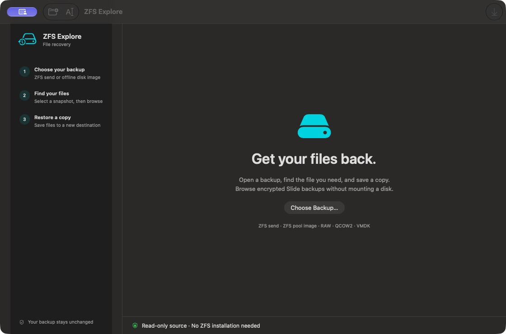

# macOS client

ZFS Explore is a native SwiftUI app for macOS 13 or later, with the same Rust
recovery engine as the CLI and Windows app. No ZFS driver or pool mount is needed.

Build on a Mac with Xcode command-line tools and Rust 1.87 or later:

```sh
./scripts/package-macos.sh
open 'target/macos-package/ZFS Explore.app'
```

The package directory contains the app, standalone `zfs-send-extract` CLI,
archives, and checksums. `ZFSE_MACOS_ARCH=arm64` (Apple Silicon) or `x86_64`
(Intel) selects an architecture; the matching Rust target must be installed.
Local builds are ad-hoc signed. Published v0.6.1 Mac downloads are Developer ID
signed and Apple-notarized. Use the `.dmg` for your architecture to obtain both
the app and CLI; it carries a stapled notarization ticket, as does the app.
The CLI tarball has the same notarized executable but no stapled ticket on the
standalone binary, so prefer the disk image for offline preparation. Normal
first-open confirmation and organization device policies still apply.

For maintainers, see the [signing and notarization procedure](macos-signing.md).

## Install by dragging to Applications

Open the disk image and drag **ZFS Explore.app** onto **Applications**. Eject
the disk image, then open **ZFS Explore** from Applications. For a ZIP download,
unzip it first and drag the complete app to Applications.

The recovery engine and app icon are inside the app bundle. You do not need to
copy the standalone CLI, install Rust or Homebrew, install a ZFS driver, or keep
the download mounted. Keep the `.app` intact; do not move its internal files.

Packaging CI checks the icon and signatures, copies the app into a separate
Applications directory, checks for non-system dynamic dependencies, and restores
a fixture using only the copied app's bundled worker. Run this check locally:

```sh
python3 scripts/verify-macos-package.py 'target/macos-package/ZFS Explore.app'
```



## Recover a file

1. Choose **Open Backup** (⌘O) and select a ZFS send, exported pool `.img`, or
   standalone disk image. **Open Path** also accepts a pasted absolute path.
2. Select the intended snapshot or dataset in the sidebar.
3. For encrypted backups, use **Enter Key** or **Choose Key File**. Slide's
   64-character raw key and 32-byte binary key files are both accepted.
4. Double-click folders. For `disk_*.raw`, double-click the image or select
   **Explore as Disk Image**, then choose the filesystem volume if necessary.
   Use **Back to outer backup** to return without reopening the source.
5. Select a regular file or folder and choose **Restore…** (⌘S). Pick a new
   destination. Existing files are never overwritten by the Mac app.
6. The completion panel shows the destination, byte count, and SHA-256 for a
   single file. **Show in Finder** reveals the result. Folder recovery reports
   skipped symlinks/special files and does not restore filesystem metadata.

Keys travel through a private child-process pipe, never command-line arguments
or a local HTTP server. The Rust engine holds key bytes in zeroizing memory.
Changing snapshots, closing a backup, or quitting discards the active key.
Swift secure-field contents are cleared on submit/dismiss; Swift/Foundation
string copies are not guaranteed to be zeroized.

The Mac app supports ZFS native encryption; Datto LUKS and agent-password UI,
physical disk discovery, and incremental application remain CLI/Windows features.
A directly supplied device path must already be readable by the current user.
Use an offline image for normal recovery. Single disk or single top-level mirror
pool layouts are supported; RAIDZ and striped/multiple-vdev pools are not.

Long operations show an indeterminate activity indicator and run off the main
thread. Byte-level progress and cancel/resume are not yet provided.

## Snapshot dates

Snapshot creation times are shown as readable dates in your Mac's current time
zone by default. Pool snapshots are newest first. Click **Times** above the
snapshot list or use **ZFS Explore → Settings…** (Command-comma) to choose UTC
or search for another city/time zone. The preference persists across restarts.
The original snapshot ID remains beneath the date and in the hover detail.
Changing the display zone preserves your selected snapshot, browsing location
and in-memory key. Offsets are included to distinguish repeated hours at the
end of daylight saving time. Undated/current views retain their original label.
