# Native Windows client

`zfs-send-explore-windows.exe` is the native Windows desktop client for ZFS Send Explore. It browses ZFS send files and supported exported pool members without installing ZFS, importing a pool, or mounting a dataset. It can extract one regular file from an exact snapshot and can advance a previously extracted file with a matching incremental send.

The executable uses the same checked stream, encryption, pool, extraction, sparse-file, and update library as `zfs-send-extract`. It does not shell out to the CLI and it does not require `libzfs` or a filesystem driver.

> [!IMPORTANT]
> This is experimental recovery software. Keep the original send file or pool member until the recovered file has been independently checked. Pool sources are opened read-only, but a pool member must still be exported or otherwise stable before it is examined.

The screenshots in this guide were captured from the real x86-64 executable on Windows 11 Pro, not from a mock-up.

## Before you start

You need:

- Windows 10 or Windows 11 on x86-64;
- `zfs-send-explore-windows.exe` from a release package or a local build;
- a ZFS send file, vdev image, whole-disk image, or exported physical member; and
- enough free space for the file being extracted. Sparse files need space for allocated ranges, not necessarily their full logical size, when the destination supports sparse files.

Administrator rights are not needed for ordinary send files and image files. Start the client with **Run as administrator** only when opening a raw device such as `\\.\PhysicalDrive1` and Windows denies normal raw-disk access.

If a release publishes a checksum, verify it before first use:

```powershell
Get-FileHash .\zfs-send-explore-windows.exe -Algorithm SHA256
```

## Window tour

The client uses Win32 common controls, Windows open/save dialogs, Segoe UI, and per-monitor DPI scaling. Long scans and extraction jobs run on background workers so the window can continue to repaint and respond.

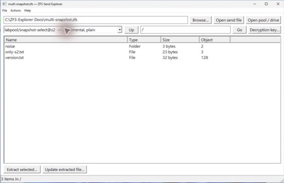

From top to bottom:

1. **Source** — a send file, vdev image, partition path, whole-disk image, or raw device name.
2. **Browse** — opens the native Windows file picker.
3. **Open send file** — interprets the source as a ZFS send stream.
4. **Open pool / drive** — reads ZFS labels and pool metadata directly from a member or image.
5. **View selector** — chooses the exact send snapshot, pool snapshot, or current read-only dataset head.
6. **Path, Up, and Go** — navigates an absolute path inside the selected filesystem view.
7. **Decryption key** — selects a passphrase, hex-key, or 32-byte raw-key file for a raw encrypted send.
8. **File list** — reports name, type, logical size, and DMU object number. Double-click a folder to enter it.
9. **Extract selected** — extracts the selected regular file through the Windows Save As dialog.
10. **Update extracted file** — validates an extracted file and advances it with a matching standalone incremental send.
11. **Status bar** — shows progress, the current path, item counts, and completed operations.

Menus provide the same source, extraction, update, key, About, and Exit actions.

## Browse a send file and select a snapshot

1. Select **Browse** and choose a `.zfs` or other send-stream file.
2. Select **Open send file**.
3. Wait for the snapshot selector and root directory to become enabled.
4. Open the view selector and choose the exact `dataset@snapshot` entry.

The label identifies whether the substream is full or incremental and whether it is plaintext or raw encrypted. The client does not silently choose among several snapshots.


A snapshot is browseable only when the selected send file also contains its complete ancestry back to a full substream. A standalone incremental does not contain the base filesystem tree.

To navigate:

- double-click a folder;
- select **Up** to visit its parent;
- type an absolute path such as `/docs` and select **Go**; or
- select another view to return to that view's root.

Only regular files can be extracted. Directories and symbolic links are listed for navigation and identification but are not recreated.

## Extract one file

1. Select a regular file in the list.
2. Select **Extract selected** or double-click the file.
3. Choose the destination in the native Save As dialog.
4. Confirm an overwrite only if replacing that destination is intended.

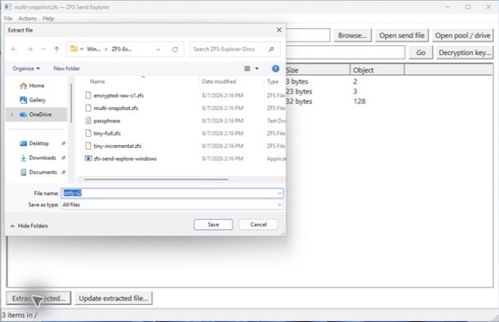

Extraction is built in a temporary file in the destination directory. The result is synchronized and moved into place only after replay and hashing finish. A failed operation leaves the requested destination unchanged.

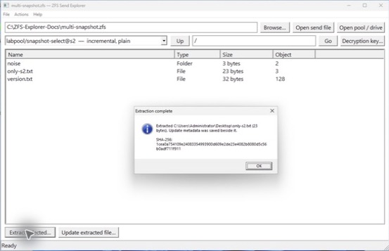

An extraction from a named send or pool snapshot also writes a sidecar beside the file:

```text
only-s2.txt
only-s2.txt.zfse.json
```

The sidecar records the source path, DMU object identity, base snapshot GUID, logical size, and SHA-256 needed for a later incremental update. It does not contain an encryption key. Keep the file and sidecar together and do not edit the sidecar.

An extraction from a current pool dataset head deliberately has no update-eligible sidecar because a moving head is not a valid incremental-send base.

## Browse a raw encrypted send

Snapshot names and stream framing remain visible in a raw send created by `zfs send -w`, but paths and file contents require the dataset key. Opening the source before choosing a key produces an explicit prompt instead of displaying unauthenticated data.

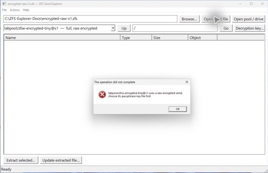

1. Open the raw send file.
2. Select **Decryption key**.
3. Choose one of the supported key-file formats:
   - passphrase text, with one final newline ignored;
   - hexadecimal key text, with one final newline ignored; or
   - exactly 32 raw binary bytes.
4. The current directory is reread automatically after the key is accepted.

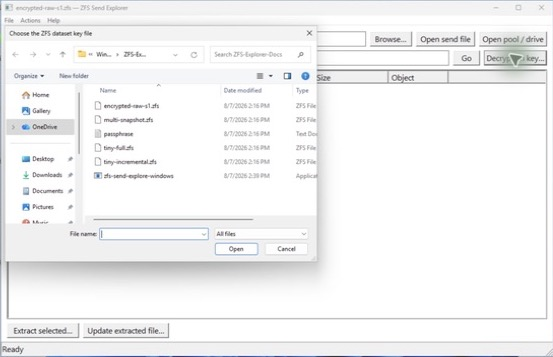

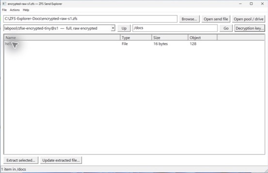

Key-file reads are bounded. Key bytes are zeroized after the operation and are never saved in `.zfse.json`. Authentication tags, encrypted metadata, block tags, spill blocks, and supported indirect authentication state are verified before plaintext is used.

## Browse an attached drive or whole-disk image

### Prepare the source safely

Use an exported pool member, a detached drive, or a stable image. Do not browse a member that belongs to a pool which is currently imported and changing. A selected uberblock can otherwise refer to blocks that are freed and reused during traversal.

For a physical drive:

1. Attach the disk without initializing, formatting, or assigning it a Windows filesystem.
2. Open an elevated PowerShell and identify the correct disk number:

   ```powershell
   Get-Disk | Format-Table Number, FriendlyName, PartitionStyle, OperationalStatus, Size, IsReadOnly
   ```

3. Start ZFS Send Explorer with **Run as administrator**.
4. Enter the exact device path, for example `\\.\PhysicalDrive1`.
5. Select **Open pool / drive**.

Never guess the disk number. Re-run `Get-Disk` after attaching or removing storage because Windows numbering can change.

The source is opened read-only. The backend checks the source for all four ZFS vdev labels. If no labels are valid at the whole-disk level, it validates the primary GPT header CRC and partition-array CRC for 512-byte and 4096-byte logical sectors, bounds every table calculation, and probes non-empty partitions as read-only slices. Exactly one ZFS-bearing partition is selected automatically; multiple candidates are rejected.

The tested raw member below was attached to Windows as read-only `PhysicalDrive1`:

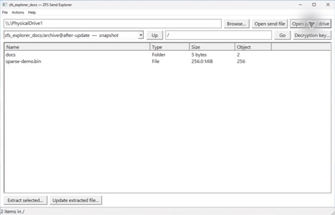

Named snapshots appear before current dataset heads. Current heads are marked **current (read-only)** and can be extracted, but they do not produce update metadata.

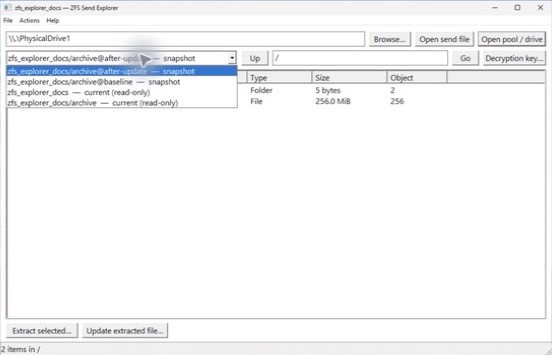

Direct pool support is intentionally conservative:

- one top-level disk or file vdev;
- one healthy leaf from one top-level mirror;
- plaintext ZFS filesystem datasets; and
- the checksum, compression, ZAP, System Attribute, and indirection profiles listed in the main README.

RAIDZ/dRAID, several top-level vdevs, native-encrypted on-disk datasets, special/dedup allocation classes, device-removal maps, gang blocks, and ZVOL file browsing are rejected. A send file can still be used when the direct member reader cannot assemble the pool layout.

## Sparse-file behavior

Sparse handling is automatic; there is no checkbox to enable it.

- Windows destinations are marked sparse with `FSCTL_SET_SPARSE`.
- Unwritten ZFS blocks and zero replay ranges remain holes.
- Freed ranges use `FSCTL_SET_ZERO_DATA` on sparse-capable Windows filesystems.
- Updates use `FSCTL_QUERY_ALLOCATED_RANGES` so copying the base file does not expand existing holes.
- The logical SHA-256 still includes every zero byte in a hole.
- If the destination does not support sparse controls, the logical bytes remain correct but zero ranges may consume physical space.

The attached-drive test extracted a file with a 256 MiB logical size and data only at its beginning and end:

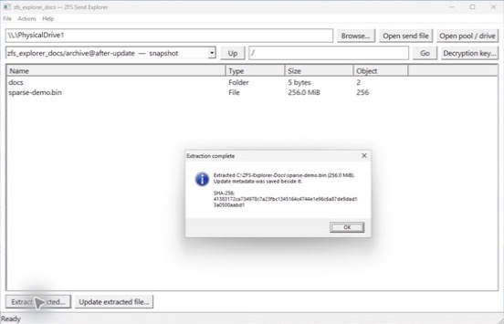

Windows reported the result as `Archive, SparseFile`. Its two allocated ranges were each 128 KiB, for 256 KiB allocated versus 256 MiB logical. Both boundary markers were verified after extraction:

```text
Head: ZFS-SPARSE-START
Tail: ZFS-SPARSE-END
Allocated range 1: offset 0x0,       length 0x20000
Allocated range 2: offset 0xffe0000, length 0x20000
```

You can inspect a recovered sparse file with:

```powershell
Get-Item .\sparse-demo.bin | Format-List Length, Attributes
fsutil sparse queryrange .\sparse-demo.bin
```

Allocated range sizes are rounded to the filesystem's allocation behavior and can differ by destination volume.

## Update a previously extracted file

An incremental send describes changes by base snapshot and DMU object number, not by a recoverable pathname. Therefore the target must first be extracted from the matching named base snapshot by this tool.

Prerequisites:

- the extracted file is still byte-for-byte unchanged;
- its `.zfse.json` sidecar is beside it;
- the update source is a standalone incremental send whose `fromguid` matches the sidecar; and
- the same key is available when applying a raw encrypted incremental.

To update:

1. Select **Update extracted file**.
2. Choose the previously extracted target. The dialog makes its adjacent sidecar visible for confirmation.

   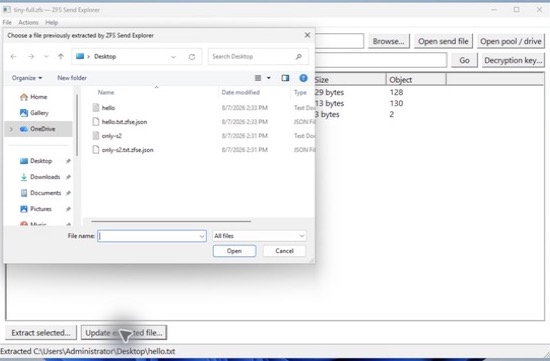

3. Choose the matching incremental ZFS send file.

   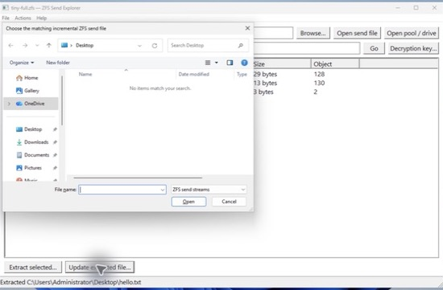

4. Wait for **Update complete**, which reports the new snapshot GUID, logical size, and SHA-256.

   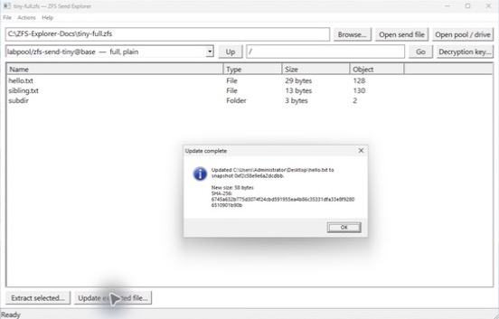

Before replacement, the client verifies:

- the target's current logical size and SHA-256;
- the incremental stream's `fromguid` against the sidecar snapshot GUID;
- the stable DMU object and required bonus/spill metadata;
- replay-record and stream checksums; and
- for raw encrypted sends, key identity, block tags, authenticated metadata, spill data, and updated dnode-range authentication.

The target is copied into a same-directory sparse temporary file. Matching `OBJECT`, `WRITE`, `WRITE_EMBEDDED`, `FREE`, and `SPILL` records are replayed there. Only a successful and synchronized result replaces the target and advances the sidecar. A local edit, wrong base, deleted/recreated object, unsupported replay feature, or authentication failure leaves the original target untouched.

## Troubleshooting

| Symptom | What to check |
| --- | --- |
| **Access is denied** when opening `PhysicalDriveN` | Start the client with **Run as administrator**, confirm the disk number, and close utilities that hold the raw device exclusively. |
| **No readable ZFS vdev label** | Confirm the pool was exported, the correct member or image was selected, and its layout is supported. For a whole disk, confirm that exactly one partition contains the intended vdev. |
| **Choose its passphrase key file first** | Select **Decryption key** and use the key format configured for that dataset. |
| The view is incremental but cannot be browsed | The send file is missing its full base or an earlier incremental in the ancestry chain. Use a self-contained history file. |
| **Extraction metadata** cannot be opened | Keep `<file>.zfse.json` beside the extracted file, or re-extract from the named base snapshot. |
| Target hash or size differs | The extracted file was changed locally. Preserve it and re-extract a clean base before applying the incremental. |
| Incremental `fromguid` does not match | The chosen incremental starts from another snapshot. Select the send whose base is the sidecar's snapshot. |
| A current pool head cannot be updated | Re-extract the file from a named snapshot so a stable base GUID and sidecar can be recorded. |
| Sparse extraction has the right length but consumes full space | The destination filesystem may not support Windows sparse controls, or a storage layer may materialize holes. Logical content remains authoritative. |
| An older build reports **Incorrect function** for a raw drive | Update to a build containing the Windows physical-drive length probe; ordinary file metadata calls do not work for every raw device handle. |

Error dialogs include the underlying operation context. The CLI can be used to reproduce most send-file or image-file failures in a terminal when more scripted diagnostics are useful.

## Build and package

Building natively requires Rust 1.87 or later, the stable MSVC target, and a Windows SDK/Visual Studio Build Tools installation:

```powershell
rustup default stable-x86_64-pc-windows-msvc
cargo test --all-targets
cargo build --release --bin zfs-send-explore-windows
.\scripts\package-windows.ps1
```

The executable is written to:

```text
target\release\zfs-send-explore-windows.exe
```

The packaging script creates:

```text
target\windows-package\zfs-send-explore-windows-x86_64.zip
```

The native build embeds `packaging/windows/zfs-send-explore-windows.exe.manifest`. It requests Common Controls 6, per-monitor V2 DPI behavior, Windows 10/11 compatibility, long paths, and `asInvoker` execution. Ordinary send work therefore does not trigger elevation; use **Run as administrator** only for a raw physical drive when required.

## Screenshot validation record

The illustrated workflows were exercised on Microsoft Windows 11 Pro build 26100 with the x86-64 GNU cross-build whose SHA-256 was:

```text
d5ced64ce03b607352309a1d6ca3443515dd2f7494ddc3de211451080fa21a9e
```

The run covered:

- a three-snapshot full/incremental send history;
- extraction plus sidecar creation;
- a successful 29-byte to 58-byte incremental update;
- a full raw encrypted send with an authenticated passphrase key;
- a read-only 1 GiB single-vdev pool member with two snapshots; and
- a 256 MiB logical sparse file with 256 KiB allocated on NTFS.

The repository test suite, native clippy pass, Windows-target clippy pass, and release cross-build were rerun after the Windows-only update, raw-device, and sparse-leaf fixes discovered during this validation.
