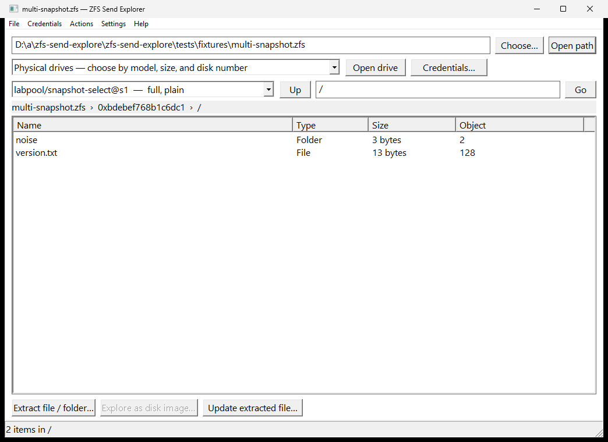
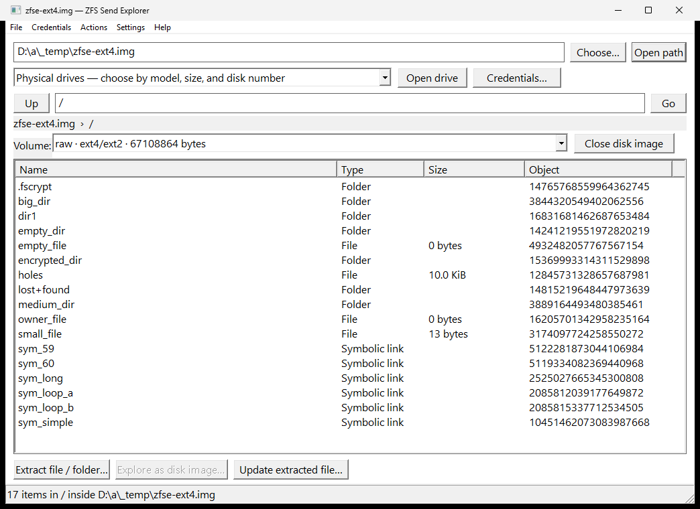
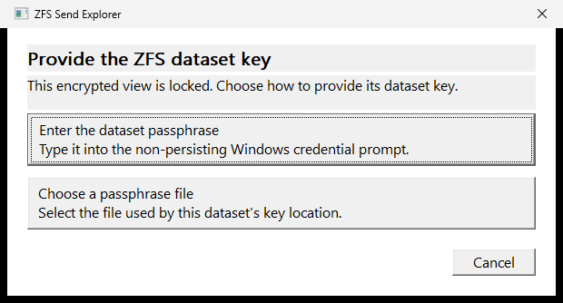
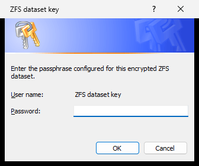

# Native Windows client

`zfs-send-explore-windows.exe` is the native Windows recovery client for ZFS send files, Slide Boxes, Datto Reverse RoundTrip drives, exported pool members, and standalone disk images. It does not install ZFS, `cryptsetup`, a filesystem driver, or mount a source. It can browse and extract one file or a staged directory tree, descend through disk images recursively, and advance a previously extracted ZFS file with a matching incremental send.

The executable uses the same checked stream, encryption, pool, extraction, sparse-file, and update library as `zfs-send-extract`. It does not shell out to the CLI and it does not require `libzfs` or a filesystem driver.

> [!IMPORTANT]
> This is experimental recovery software. Keep the original send file or pool member until the recovered file has been independently checked. Pool sources are opened read-only, but a pool member must still be exported or otherwise stable before it is examined.

The screenshots in this guide were captured from the real x86-64 executable on Windows 11 Pro, not from a mock-up.

## Before you start

You need:

- Windows 10 or Windows 11 on x86-64;
- `zfs-send-explore-windows.exe` from a release package or a local build;
- a ZFS send file, vdev image, whole-disk image, or exported physical member; and
- enough free space for the file being extracted. Sparse files need space for allocated ranges, not necessarily their full logical size, when the destination supports sparse files.

Administrator rights are not needed for ordinary send files and image files. Start the client with **Run as administrator** only when opening a raw device such as `\\.\PhysicalDrive1` and Windows denies normal raw-disk access.

If a release publishes a checksum, verify it before first use:

```powershell
Get-FileHash .\zfs-send-explore-windows.exe -Algorithm SHA256
```

## Window tour

The client uses Win32 common controls, Windows open/save dialogs, Segoe UI, and per-monitor DPI scaling. Long scans and extraction jobs run on background workers so the window can continue to repaint and respond.



From top to bottom:

1. **Source path, Choose, and Open path** — **Choose** selects and immediately opens a source; **Open path** handles a pasted or manually typed path. Either flow detects a send stream, pool member, whole-disk image, or standalone filesystem image automatically.
2. **Physical-drive picker** — enumerates `PhysicalDriveN` devices with disk number, model, capacity, and fixed/removable type. Press **F5** after attaching or removing storage.
3. **Open drive** — confirms the exact selected disk, then opens it read-only. Manual device-path entry remains available.
4. **Credentials** — enters a ZFS key, Datto pool passphrase, or Datto agent password directly through the secure Windows credential prompt, loads one from a file, or clears all in-memory secrets.
5. **View selector** — chooses an exact send snapshot, pool snapshot, or current read-only dataset head.
6. **Path, Up, and Go** — navigates an absolute path. The line below shows the complete source, view, nested-image, and current-path breadcrumb.
7. **Inner volume selector** — appears only while a disk image is active and chooses a detected raw, GPT, or MBR filesystem.
8. **Advanced selected-file range** — hidden by default. **Settings > Show advanced disk-image range fields** reveals a byte offset and optional length for an embedded child image. Values accept decimal or `0x` hexadecimal and reset after each successful descent.
9. **Open disk image** — sits beside Extract and opens the selected regular file as another raw, QCOW2, or VMDK layer.
10. **Back to ZFS files / Back one image / Close disk image** — changes with context and preserves the parent directory and volume selection.
11. **File list** — shows name, type, logical size, and object/entry identifier. Folders and recognized images open with double-click or **Enter**.
12. **Extract** and **Update** — recover the selected file/folder or apply a validated standalone incremental send.
13. **Status bar** — reports scanning, directory reads, credential state changes, extraction, and errors.

Menus expose the same operations plus persisted usability and safety settings.

## Browse a send file and select a snapshot

1. Select **Choose** and choose a `.zfs` or other send-stream file. The app opens it and recognizes the format automatically.
2. Wait for the snapshot selector and root directory to become enabled.
3. Open the view selector and choose the exact `dataset@snapshot` entry.

The label identifies whether the substream is full or incremental and whether it is plaintext or raw encrypted. The client does not silently choose among several snapshots.


A snapshot is browseable only when the selected send file also contains its complete ancestry back to a full substream. A standalone incremental does not contain the base filesystem tree.

To navigate:

- double-click a folder;
- select **Up** to visit its parent;
- type an absolute path such as `/docs` and select **Go**; or
- select another view to return to that view's root.

Regular files and directories can be extracted. A directory is recovered recursively; symbolic links and special entries are counted and skipped rather than followed.

## Open standalone and nested disk images

Inception mode now starts from either a local image file or a regular image file inside the active ZFS/inner filesystem. Every partition and filesystem read stays positioned back to the original source. The GUI does not export a full image, attach a virtual disk, install a filesystem driver, or mount anything.

To open a standalone image, select **Choose** and choose the image. **Ctrl+Shift+O** opens the image-specific picker directly. **Open path** remains available for a pasted path.



1. Browse to any supported filesystem directory containing the image and select its regular-file row.
2. Select **Open disk image…**. The normal whole-file case needs no offset or length. The scan validates the container and partition metadata before enabling inner navigation.
3. If the image is embedded inside the selected file, enable **Settings > Show advanced disk-image range fields**, enter its byte offset and optional length, and try again. The app also offers this action directly after an image-open failure.
4. Choose a supported item in the inner volume selector if the image has several partitions.
5. Navigate and extract with the same controls used for ZFS browsing. A recognized image extension opens on double-click or **Enter**.
6. Repeat from inside that filesystem to descend again, up to eight simultaneous layers.
7. Select the contextual Back/Close button or press **Esc** to return exactly one layer. The parent path and volume selection are restored.

The GUI recognizes:

- raw and sparse images, including an unpartitioned filesystem;
- self-contained QCOW2 v2/v3 images;
- self-contained VMDK `monolithicSparse` images;
- CRC-validated GPT, with primary/backup recovery and 512- or 4096-byte logical sectors;
- MBR primary and extended/logical partitions; and
- NTFS, FAT12/16/32, exFAT, ext4, and compatible ext2 subordinate filesystems.

Sources and all inner layers remain read-only. Nested file reads are served on demand through the active filesystem; a multi-terabyte child image is not materialized just to inspect its partitions. An extracted inner file is built in a same-directory sparse temporary file, synchronized, hashed with SHA-256, and moved into place only after success. It receives no `.zfse.json` sidecar because it is not a directly addressable ZFS object.

The initial implementation intentionally rejects QCOW1, QCOW2 backing-file overlays and encryption, split/flat/stream-optimized VMDKs, compressed NTFS data streams, EFS-encrypted files, and non-UTF-8 ext names. ext symlinks are visible but are not followed for extraction. An error dialog reports the unsupported layer instead of falling back to potentially incorrect raw interpretation.

## Extract a file or folder

1. Select a regular file or folder in the list.
2. Select **Extract file / folder**. Double-clicking a regular file also extracts it; double-clicking a folder navigates into it.
3. Choose the destination file or new destination-folder name in the native Save As dialog.
4. Confirm an overwrite only if replacing that destination is intended.


Extraction is built in a temporary file in the destination directory. The result is synchronized and moved into place only after replay and hashing finish. A failed operation leaves the requested destination unchanged.

A folder is built in a unique staging directory beside its destination. The
new tree is published only after every regular file succeeds. Confirming an
overwrite first moves the previous tree into that staging directory, publishes
the new tree, and then removes the replaced tree. Symlinks and unsupported
special entries are never followed. Recursive extraction recreates directory
names and regular-file bytes, but not ACLs, ownership, permissions, alternate
NTFS streams, or other filesystem metadata.


An extraction from a named send or pool snapshot also writes a sidecar beside the file:

```text
only-s2.txt
only-s2.txt.zfse.json
```

The sidecar records the source path, DMU object identity, base snapshot GUID, logical size, and SHA-256 needed for a later incremental update. It does not contain an encryption key. Keep the file and sidecar together and do not edit the sidecar.

An extraction from a current pool dataset head deliberately has no update-eligible sidecar because a moving head is not a valid incremental-send base.

## Browse an encrypted source

Snapshot names and stream framing remain visible in a raw send created by `zfs send -w`, but paths and contents require the dataset key. A native-encrypted pool likewise exposes its catalog before filesystem traversal needs a key. Selecting an encrypted view opens a format-aware choice at the lock point instead of sending the user to another menu.



For `keyformat=raw`, choose either **Paste a hexadecimal raw key** for Slide's 64-character representation or **Choose a raw key file** for the original 32 binary bytes (a 64-character text file is accepted too). `keyformat=hex` and `keyformat=passphrase` receive correspondingly specific actions. Choosing direct entry then opens the protected Windows prompt:



Use **Credentials** or **Ctrl+K** at any time. When the selected view or file identifies a required credential, this opens the same relevant choices; otherwise it opens the complete credential menu. It supports:

- direct, masked entry of a ZFS passphrase or 64-character hexadecimal key;
- a ZFS key file containing passphrase text, hexadecimal text, or exactly 32 raw binary bytes;
- direct or file-backed Datto LUKS pool passphrases;
- direct or file-backed Datto agent passwords; and
- immediate clearing of every in-memory credential.

Directly entered secrets and loaded file bytes live only in zeroizing process memory. Windows credential persistence is disabled. ZFS keys are scoped to both the source and selected view, so several encrypted datasets may retain distinct keys without silently reusing one another. Pool and agent credentials are source-scoped. They are never written to settings or `.zfse.json`. Clearing credentials first explains that the current source must close, then releases every retained value, including an outer pool-unlock key owned by its read session.

Missing or rejected ZFS, Datto pool, and Datto agent credentials reopen the relevant two-choice action and retry the interrupted browse/open operation after replacement. Canceling a failed new-source attempt preserves the previously working source and its directory listing.

Authentication tags, encrypted metadata, block tags, spill blocks, and supported indirect authentication state are verified before plaintext is used. Native-encrypted pools additionally verify inherited encryption-root discovery, wrapped keys, the objset portable MAC, encrypted dnode bonuses, and folded physical checksums.

## Browse an attached drive or whole-disk image

### Prepare the source safely

Use an exported pool member, a detached drive, or a stable image. Do not browse a member that belongs to a pool which is currently imported and changing. A selected uberblock can otherwise refer to blocks that are freed and reused during traversal.

For a physical drive:

1. Attach the disk without initializing, formatting, or assigning it a Windows filesystem.
2. Press **F5** and choose the drive by disk number, model, capacity, and fixed/removable type.
3. Select **Open drive** and read the confirmation carefully. The displayed `PhysicalDriveN` must match the intended disk.
4. If Windows reports **Access is denied**, restart ZFS Send Explorer with **Run as administrator** and make the same selection again.

For an independent cross-check, PowerShell reports the same disk numbers:

   ```powershell
   Get-Disk | Format-Table Number, FriendlyName, PartitionStyle, OperationalStatus, Size, IsReadOnly
   ```

Never guess the disk number. Refresh after attaching or removing storage because Windows numbering can change. Power users may still type an exact `\\.\PhysicalDriveN` path and use **File > Open selected physical drive**.

The source is opened read-only. The backend checks the source for all four ZFS vdev labels. If no labels are valid at the whole-disk level, it validates GPT or bounded MBR metadata and probes non-empty partitions as read-only slices. A LUKS1/LUKS2 partition is unlocked in userspace when the Datto pool key has been selected, then probed for ZFS labels without creating a Windows block device. Exactly one ZFS-bearing payload is selected automatically; multiple candidates are rejected.

The tested raw member below was attached to Windows as read-only `PhysicalDrive1`:


Named snapshots appear before current dataset heads. Current heads are marked **current (read-only)** and can be extracted, but they do not produce update metadata.


Direct pool support is intentionally conservative:

- one top-level disk or file vdev;
- one healthy leaf from one top-level mirror;
- plaintext or native-encrypted little-endian ZFS filesystem datasets; and
- the checksum, compression, ZAP, System Attribute, and indirection profiles listed in the main README.

RAIDZ/dRAID, several top-level vdevs, encrypted big-endian pools, special/dedup allocation classes, device-removal maps, gang blocks, and ZVOL file browsing are rejected. A send file can still be used when the direct member reader cannot assemble the pool layout.

## Recover a Slide Box

1. Attach a Slide Box drive or the complete supported member, press **F5**, and
   choose it by model, size, and disk number.
2. Select **Open drive**. A pool named `slide` is labeled as a Slide Box
   and its `slide/agents/a_*` datasets appear in the view selector.
3. Select the intended agent dataset or named snapshot.
4. Open **Credentials**. Enter Slide's 64-character hexadecimal raw key directly,
   or choose the 32-byte/hex key file supplied by Slide.
5. Select a `disk_*.raw` row and choose **Explore disk image**.
6. Select the Windows volume, browse it, and extract a file or folder.

The current direct-pool constraints still apply. A Slide Box using RAIDZ or
several top-level vdevs cannot yet be reconstructed from multiple members.

## Recover a Datto Reverse RoundTrip drive

1. Attach the drive, press **F5**, and choose it by model, size, and disk number.
2. Select **Open drive**. If the drive is LUKS-protected, choose direct pool-passphrase entry or its passphrase file in the contextual prompt. The app retries automatically after the credential is supplied.
3. The app detects GPT or MBR, unlocks the LUKS
   payload internally, and labels a `revRT-*` pool as Datto Reverse RoundTrip.
4. Select the protected-system dataset under `POOL/home/agents/AGENT_GUID`.
5. For `.datto`, select the image and choose **Explore disk image** directly.
6. For `.detto`, choose direct **Datto agent password** entry or its text file when the image is opened. A rejected password returns to the same choices and retries the image after replacement.

For `.detto`, the app finds the single `config/*.encryptionKeyStash` file,
authenticates it with the supplied password, derives the 64-byte AES-XTS key,
and decrypts requested sectors on demand. Pool and agent passwords are distinct
roles and neither is passed to an external executable. No decrypted disk image
is materialized on the host.

## Sparse-file behavior

Sparse handling is automatic; there is no checkbox to enable it.

- Windows destinations are marked sparse with `FSCTL_SET_SPARSE`.
- Unwritten ZFS blocks and zero replay ranges remain holes.
- Freed ranges use `FSCTL_SET_ZERO_DATA` on sparse-capable Windows filesystems.
- Updates use `FSCTL_QUERY_ALLOCATED_RANGES` so copying the base file does not expand existing holes.
- The logical SHA-256 still includes every zero byte in a hole.
- If the destination does not support sparse controls, the logical bytes remain correct but zero ranges may consume physical space.

The attached-drive test extracted a file with a 256 MiB logical size and data only at its beginning and end:


Windows reported the result as `Archive, SparseFile`. Its two allocated ranges were each 128 KiB, for 256 KiB allocated versus 256 MiB logical. Both boundary markers were verified after extraction:

```text
Head: ZFS-SPARSE-START
Tail: ZFS-SPARSE-END
Allocated range 1: offset 0x0,       length 0x20000
Allocated range 2: offset 0xffe0000, length 0x20000
```

You can inspect a recovered sparse file with:

```powershell
Get-Item .\sparse-demo.bin | Format-List Length, Attributes
fsutil sparse queryrange .\sparse-demo.bin
```

Allocated range sizes are rounded to the filesystem's allocation behavior and can differ by destination volume.

## Update a previously extracted file

An incremental send describes changes by base snapshot and DMU object number, not by a recoverable pathname. Therefore the target must first be extracted from the matching named base snapshot by this tool.

Prerequisites:

- the extracted file is still byte-for-byte unchanged;
- its `.zfse.json` sidecar is beside it;
- the update source is a standalone incremental send whose `fromguid` matches the sidecar; and
- the same key is available when applying a raw encrypted incremental.

To update:

1. Select **Update extracted file**.
2. Choose the previously extracted target. The dialog makes its adjacent sidecar visible for confirmation.

   

3. Choose the matching incremental ZFS send file.

   

4. Wait for **Update complete**, which reports the new snapshot GUID, logical size, and SHA-256.

   

Before replacement, the client verifies:

- the target's current logical size and SHA-256;
- the incremental stream's `fromguid` against the sidecar snapshot GUID;
- the stable DMU object and required bonus/spill metadata;
- replay-record and stream checksums; and
- for raw encrypted sends, key identity, block tags, authenticated metadata, spill data, and updated dnode-range authentication.

The target is copied into a same-directory sparse temporary file. Matching `OBJECT`, `WRITE`, `WRITE_EMBEDDED`, `FREE`, and `SPILL` records are replayed there. Only a successful and synchronized result replaces the target and advances the sidecar. A local edit, wrong base, deleted/recreated object, unsupported replay feature, or authentication failure leaves the original target untouched.

## Keyboard shortcuts and settings

| Shortcut | Action |
| --- | --- |
| **Ctrl+O** | Choose, open, and automatically detect a backup, pool member, or image |
| **Ctrl+Shift+O** | Choose and open a standalone disk image |
| **Ctrl+D** | Open the selected physical drive |
| **Ctrl+K** | Open credential choices for the current view or selected `.detto` image |
| **Ctrl+L** | Focus the path box |
| **Alt+Up** or **Backspace** | Go to the parent directory |
| **Enter** | Open a folder or recognized disk image; extract another regular file |
| **Ctrl+I** | Explore the selected regular file as a disk image |
| **Esc** | Return one image layer |
| **Ctrl+E** | Extract the selected file or folder |
| **Ctrl+U** | Update a previously extracted file |
| **F5** | Refresh the current directory and physical-drive inventory |

The **Settings** menu persists to `%APPDATA%\ZFS Send Explorer\settings.json`. It controls recognized-image double-click behavior, source-scoped credential clearing, physical-drive confirmation, and visibility of advanced disk-image range fields. Window dimensions are also restored. The settings file contains no keys, passwords, source contents, or recovery metadata.

## Troubleshooting

| Symptom | What to check |
| --- | --- |
| **Access is denied** when opening `PhysicalDriveN` | Start the client with **Run as administrator**, confirm the disk number, and close utilities that hold the raw device exclusively. |
| **No readable ZFS vdev label** | Confirm the pool was exported, the correct member or image was selected, and its layout is supported. For a whole disk, confirm that exactly one partition contains the intended vdev. |
| The encrypted view remains locked | Use **Credentials** or **Ctrl+K**. A raw dataset offers 64-character hexadecimal entry and a 32-byte raw-file chooser in the same dialog. |
| The view is incremental but cannot be browsed | The send file is missing its full base or an earlier incremental in the ancestry chain. Use a self-contained history file. |
| **Extraction metadata** cannot be opened | Keep `<file>.zfse.json` beside the extracted file, or re-extract from the named base snapshot. |
| Target hash or size differs | The extracted file was changed locally. Preserve it and re-extract a clean base before applying the incremental. |
| Incremental `fromguid` does not match | The chosen incremental starts from another snapshot. Select the send whose base is the sidecar's snapshot. |
| A current pool head cannot be updated | Re-extract the file from a named snapshot so a stable base GUID and sidecar can be recorded. |
| **No supported inner filesystem** | Use the offered **Extract the image file instead** or **Set an advanced image range** action; CLI `inception inspect` provides per-volume diagnostics. |
| A valid filesystem starts after an appliance header | Choose **Set an advanced image range**, enter its exact byte offset and optional length, then select **Open disk image…** again. |
| QCOW or VMDK reports an unsupported feature | Use a self-contained QCOW2 v2/v3 or VMDK `monolithicSparse` image. Backing files and external/split VMDK extents are not guessed or searched for. |
| An inner NTFS file cannot be extracted | NTFS compression and EFS encryption are currently rejected; select an ordinary unnamed `$DATA` file stream. |
| Sparse extraction has the right length but consumes full space | The destination filesystem may not support Windows sparse controls, or a storage layer may materialize holes. Logical content remains authoritative. |
| An older build reports **Incorrect function** for a raw drive | Update to a build containing the Windows physical-drive length probe; ordinary file metadata calls do not work for every raw device handle. |

Error dialogs include the underlying operation context. The CLI can be used to reproduce most send-file or image-file failures in a terminal when more scripted diagnostics are useful.

## Build and package

Building natively requires Rust 1.87 or later, the stable MSVC target, and a Windows SDK/Visual Studio Build Tools installation:

```powershell
rustup default stable-x86_64-pc-windows-msvc
cargo test --all-targets
cargo build --release --bin zfs-send-explore-windows
.\scripts\package-windows.ps1
```

The executable is written to:

```text
target\release\zfs-send-explore-windows.exe
```

The packaging script creates:

```text
target\windows-package\zfs-send-explore-windows-x86_64.zip
```

The native build embeds `packaging/windows/zfs-send-explore-windows.exe.manifest`. It requests Common Controls 6, per-monitor V2 DPI behavior, Windows 10/11 compatibility, long paths, and `asInvoker` execution. Ordinary send work therefore does not trigger elevation; use **Run as administrator** only for a raw physical drive when required.

## Screenshot validation record

The illustrated workflows were exercised on Microsoft Windows 11 Pro build 26100 with the x86-64 GNU cross-build whose SHA-256 was:

```text
d5ced64ce03b607352309a1d6ca3443515dd2f7494ddc3de211451080fa21a9e
```

The run covered:

- a three-snapshot full/incremental send history;
- extraction plus sidecar creation;
- a successful 29-byte to 58-byte incremental update;
- a full raw encrypted send with an authenticated passphrase key;
- a read-only 1 GiB single-vdev pool member with two snapshots; and
- a 256 MiB logical sparse file with 256 KiB allocated on NTFS.

The v0.5.1 screenshots at the top of this guide are captured automatically from
the optimized native executable on a GitHub-hosted Windows runner. The run opens
the committed multi-snapshot send fixture, captures the format-aware credential
method chooser and real Windows secure prompt, and opens the committed ext4
fixture as a standalone image. The final capture is recorded in
[workflow run 31282726061](https://github.com/amcchord/zfs-send-explore/actions/runs/31282726061).
The service test also descends through a FAT image stored inside another FAT
image and reads its child directory without exporting either image.

The older workflow screenshots remain as historical evidence for extraction,
incremental updates, encrypted browsing, and an attached physical member. The
v0.4.0 parser/service tests cover Slide/Datto inputs, LUKS detection,
authenticated `.detto` adaptation, and staged folder recovery. Representative
physical Slide and Datto media remain a separate hardware acceptance item.
